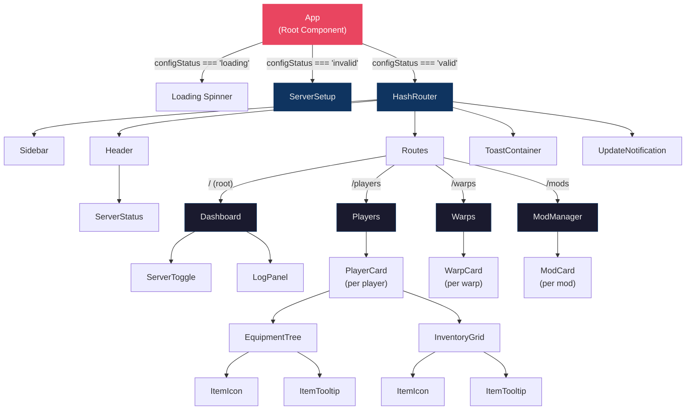

# Component Hierarchy

The Hytale Server Manager renderer is a React 19 single-page application with 4 page components and 18 reusable components organized across 8 domain directories. The root `App` component gates the entire UI on the server path configuration status before rendering the main application shell with `HashRouter`.

**Related Documents:**
- [Type Definitions](type-definitions.md) -- TypeScript interfaces consumed by components and stores (PlayerData, ModInfo, Warp, WorldMapData, ServerStatus)
- [Utility Modules](utility-modules.md) -- Shared helpers used by components: asset URL builders (`getItemIconPath`, `getNpcPortraitPath`), display formatters (`formatBytes`, `formatCoords`, `formatDate`), and i18n translation (`formatItemId`)

## Component Tree Diagram

## Application Gate Logic

`App.tsx` initializes three stores on mount (`updater-store`, `config-store`, `asset-store`) and uses the `configStatus` value from `config-store` to decide what to render:

| `configStatus` | Rendered UI | Description |
|----------------|-------------|-------------|
| `loading` | Centered loading spinner | Config is being fetched from the main process via `config:get-server-path` |
| `invalid` | `ServerSetup` component | No valid server directory configured; user must select one |
| `valid` | Full application shell with `HashRouter` | Server path is valid; file watcher and asset extraction are active |

## Component Reference

### Layout Components (`components/layout/`)

| Component | File | Purpose | Stores Used |
|-----------|------|---------|-------------|
| `Sidebar` | `Sidebar.tsx` | Left navigation panel with `NavLink` items for all 4 routes. Displays app version from updater-store. | `updater-store` |
| `Header` | `Header.tsx` | Top bar with application title and `ServerStatus` badge. | None (delegates to `ServerStatus`) |
| `ToastContainer` | `ToastContainer.tsx` | Renders queued toast notifications from the toast store. | `toast-store` |

### Server Components (`components/server/`)

| Component | File | Purpose | Stores Used |
|-----------|------|---------|-------------|
| `ServerToggle` | `ServerToggle.tsx` | Start/Stop button. Disables during transitional states (`starting`, `stopping`). Green when stopped, red when running, yellow when transitioning. | `server-store` |
| `ServerStatus` | `ServerStatus.tsx` | Color-coded status badge (green dot = running, yellow = transitioning, red = stopped). Rendered inside `Header`. | `server-store` |
| `LogPanel` | `LogPanel.tsx` | Scrollable server console log with ANSI color parsing, auto-scroll, expand/collapse toggle, and clear button. Caps at 1000 entries. | `server-store` |

### Player Components (`components/players/`)

| Component | File | Purpose | Stores Used |
|-----------|------|---------|-------------|
| `PlayerCard` | `PlayerCard.tsx` | Expandable card per player showing name, game mode, world. Expands to show `EquipmentTree` and `InventoryGrid` sections. | None (receives props) |
| `EquipmentTree` | `EquipmentTree.tsx` | Combined equipment + stats + location panel. Shows armor slots (via internal `EquipmentSlot` function), utility/tool items, stat bars (via internal `StatRow` function for health, stamina, mana, oxygen), coordinates, respawn points, death markers, discovered zones. | None (receives props) |
| `InventoryGrid` | `InventoryGrid.tsx` | Grid layout for inventory sections (Hotbar 9-slot, Backpack 9-slot, Storage 36-slot). Supports hover tooltips. | None (receives props) |
| `ItemIcon` | `ItemIcon.tsx` | Loads item icon via `asset:///items/{name}.png` URL. Watches `asset-store` status to reload icon map when assets become ready. Falls back to text label on image load error. | `asset-store` |
| `ItemTooltip` | `ItemTooltip.tsx` | Positioned tooltip overlay showing item name, quantity, and durability when hovering an inventory slot. | None (receives props) |

### Error Handling Components (`components/`)

| Component | File | Purpose | Stores Used |
|-----------|------|---------|-------------|
| `ErrorBoundary` | `ErrorBoundary.tsx` | React class component that catches JavaScript errors in child component tree, logs errors, and displays a fallback UI with reload button. Prevents app crashes from propagating. | None (class component with internal state) |

### Mod Components (`components/mods/`)

| Component | File | Purpose | Stores Used |
|-----------|------|---------|-------------|
| `ModCard` | `ModCard.tsx` | Card per mod showing name, size, `hasStateFile` indicator, and enable/disable toggle. Toggle is disabled while the server is running or starting. | None (receives props + callback) |

### Warp Components (`components/warps/`)

| Component | File | Purpose | Stores Used |
|-----------|------|---------|-------------|
| `WarpCard` | `WarpCard.tsx` | Card per warp showing warp ID, world, position coordinates, and creation date. | None (receives props) |

### Setup Components (`components/setup/`)

| Component | File | Purpose | Stores Used |
|-----------|------|---------|-------------|
| `ServerSetup` | `ServerSetup.tsx` | First-run setup screen. Allows user to browse for and select a Hytale Server directory. Validates the selection and provides a "Continue" button when the path is valid. | `config-store` |

### Update Components (`components/updates/`)

| Component | File | Purpose | Stores Used |
|-----------|------|---------|-------------|
| `UpdateNotification` | `UpdateNotification.tsx` | Modal overlay for the auto-update lifecycle. Shows download progress and provides install button when an update is downloaded. | `updater-store` |

## Page Components (`pages/`)

| Page | File | Route | Store Listeners Initialized | Child Components |
|------|------|-------|---------------------------|-----------------|
| `Dashboard` | `Dashboard.tsx` | `/` | `server-store`, `universe-store` (refresh), `mod-store` (refresh) | `ServerToggle`, `LogPanel` |
| `Players` | `Players.tsx` | `/players` | Calls `universe-store.fetchPlayers()` on mount | `PlayerCard` |
| `Warps` | `Warps.tsx` | `/warps` | Calls `universe-store.fetchWarps()` on mount | `WarpCard` |
| `ModManager` | `ModManager.tsx` | `/mods` | Calls `mod-store.fetchMods()` on mount | `ModCard` |

## State Management (Zustand Stores)

| Store | File | State | IPC Events Listened | IPC Invoke Calls |
|-------|------|-------|--------------------|-----------------|
| `server-store` | `server-store.ts` | `status`, `logs[]` (max 1000) | `server:status-changed`, `server:log` | `server:start`, `server:stop` |
| `universe-store` | `universe-store.ts` | `players[]`, `warps[]`, `worldMap`, `loading`, `errors` | `data:refresh` | `data:players`, `data:warps`, `data:world-map` |
| `mod-store` | `mod-store.ts` | `mods[]`, `loading`, `error` | `data:refresh` (category: mods) | `mods:list`, `mods:toggle` |
| `asset-store` | `asset-store.ts` | `status` (unknown/extracting/ready/error), `error` | `assets:extracting`, `assets:ready`, `assets:error` | `assets:status`, `assets:extract` |
| `config-store` | `config-store.ts` | `status` (loading/valid/invalid), `serverPath`, `selectedPath` | `config:server-path-changed` | `config:get-server-path`, `config:set-server-path`, `config:select-server-dir` |
| `updater-store` | `updater-store.ts` | `appVersion`, `updateState`, `updateInfo`, `progress` | `updater:checking`, `updater:available`, `updater:not-available`, `updater:progress`, `updater:downloaded`, `updater:error` | `updater:check`, `updater:download`, `updater:install`, `updater:get-version` |
| `toast-store` | `toast-store.ts` | `toasts[]` (queue with 5000ms auto-dismiss timeout) | None (internal only) | None |
