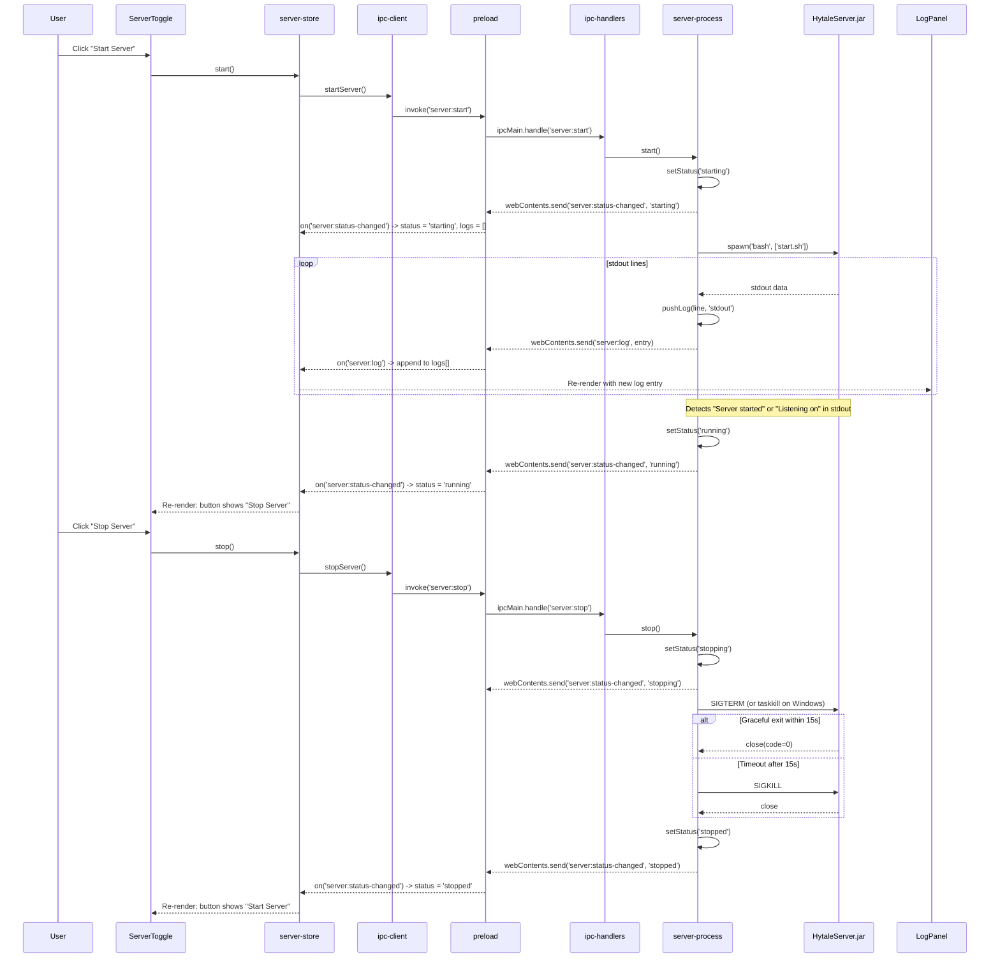
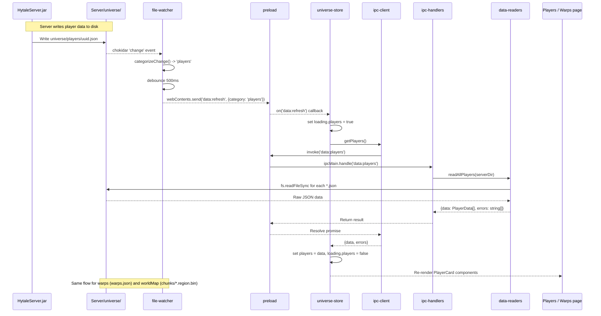
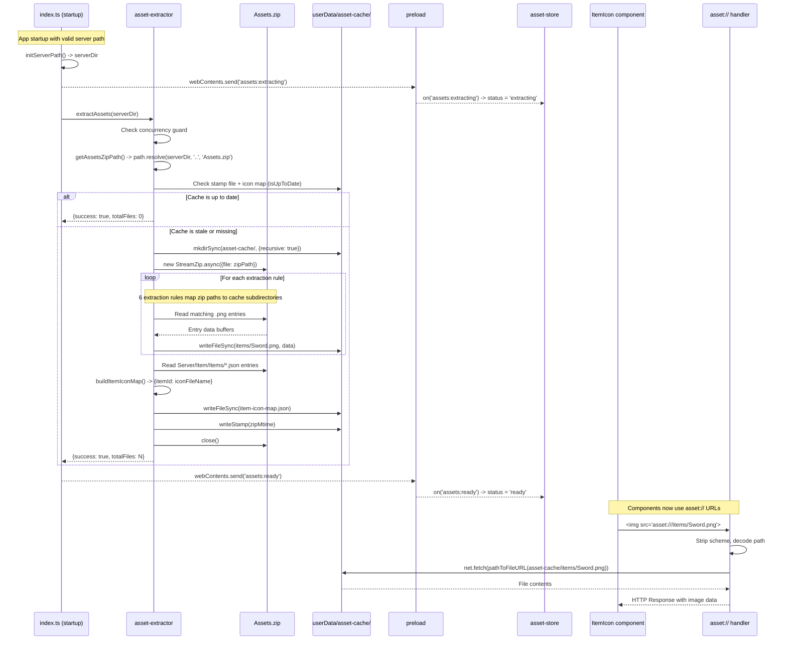
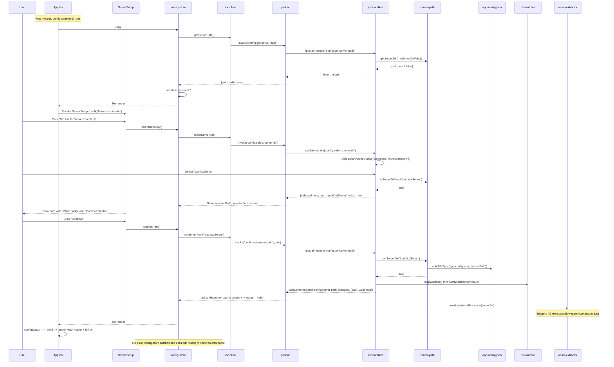

# Data Flow

This document describes the four major data flows in Hytale Server Manager: server lifecycle management, game data queries with live refresh, asset extraction with caching, and first-run configuration. Each flow is illustrated with a sequence diagram showing the exact IPC channels, modules, and state transitions involved.

> **Note:** `Server/` paths in this document refer to the user's Hytale server installation directory, selected during the app's first-run setup -- not a directory in this repository.

## Server Lifecycle Flow

The server lifecycle begins when the user clicks the Start/Stop button on the Dashboard. The `ServerToggle` component calls the `server-store`, which invokes the main process via IPC. The main process spawns the Java server using `start.sh`/`start.bat` and streams stdout/stderr back to the renderer as log entries. Status transitions (`starting` -> `running` -> `stopping` -> `stopped`) are pushed as events.

## Game Data Flow

Game data (players, warps, world map) is read from JSON and binary files in the `Server/universe/` directory. The `file-watcher` module uses chokidar to watch for filesystem changes and broadcasts categorized `data:refresh` events to the renderer. Zustand stores react by re-fetching the relevant data through IPC invoke calls.

## Asset Extraction Flow

Assets (item icons, NPC portraits, map markers) are extracted from `Assets.zip` at startup and whenever the server path changes. The extraction runs in the main process, writes files to `userData/asset-cache/`, and builds an `item-icon-map.json` index. Components reference assets via the custom `asset://` protocol which serves files directly from the cache directory.

## Configuration Flow

On first run (or when the server path is invalid), the app shows the `ServerSetup` screen instead of the main UI. The user selects a directory via the native OS dialog, the main process validates it by checking for `HytaleServer.jar`, `config.json`, or a `universe/` subdirectory, and on confirmation persists the path to `app-config.json`. After a successful path change, the file watcher restarts, assets are re-extracted, and the renderer transitions to the full application shell.

