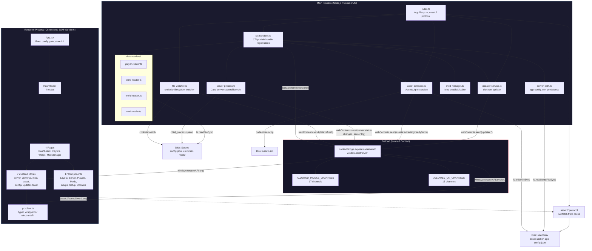

# Electron Process Architecture

Hytale Server Manager is built on Electron 40 with strict process isolation. The application runs across three distinct process boundaries: the **Main Process** (Node.js), the **Preload Script** (isolated context bridge), and the **Renderer Process** (Chromium with React 19). All inter-process communication flows through a whitelisted IPC bridge -- the renderer never has direct access to Node.js APIs or the filesystem.

The main process manages the Java game server lifecycle, reads binary and JSON game data from disk, extracts assets from `Assets.zip`, watches the filesystem for changes, and handles auto-updates. The preload script acts as a security boundary, exposing only a typed subset of IPC channels to the renderer. The renderer presents the UI using React 19, Zustand 5 for state management, and a custom `asset://` protocol for loading cached game assets.

## Process Boundary Diagram

## Module Responsibilities

> **Note:** `Server/` paths below refer to the user's Hytale server installation directory, selected during the app's first-run setup -- not a directory in this repository.

### Main Process

| Module | File | Responsibility |
|--------|------|---------------|
| App Lifecycle | `index.ts` | BrowserWindow creation, `asset://` protocol registration, startup orchestration (init path, start watcher, extract assets) |
| IPC Handlers | `ipc-handlers.ts` | Registers all 17 `ipcMain.handle()` handlers for server control, data queries, mods, config, assets, and updater |
| Server Process | `server-process.ts` | Spawns `HytaleServer.jar` via `start.sh`/`start.bat`. Validates launcher script exists via `fs.existsSync()` before spawning; provides specific error messages for ENOENT (not found) and EACCES (permission denied) errors. Manages stdout/stderr streaming, crash detection (exit < 30s), graceful shutdown (SIGTERM, 15s timeout, SIGKILL), auto-restart on exit code 8 |
| Server Path | `server-path.ts` | Persists user-selected server directory to `app-config.json`, validates paths by checking for `HytaleServer.jar` |
| File Watcher | `file-watcher.ts` | Chokidar watcher on `universe/players/`, `universe/warps.json`, `universe/worlds/`, `mods/`. Debounces at 500ms, broadcasts categorized `data:refresh` events |
| Asset Extractor | `asset-extractor.ts` | Extracts assets from `Assets.zip` into `userData/asset-cache/` using 6 extraction rules: `ItemsGenerated/ -> items/`, `Items/EditorTools/ -> items/`, `Memories/npcs/ -> npcs/`, `WorldMap/MapMarkers/ -> map-markers/`, `Memories/Tiles/ -> memory-ui/`, `Memories/categories/ -> memory-ui/categories/`. Builds `item-icon-map.json`. Stamp-based cache invalidation with concurrency guard |
| Mod Manager | `mod-manager.ts` | Moves mod directories between `Server/mods/` and `disabled-mods/` to toggle enabled state |
| Updater Service | `updater-service.ts` | Initializes `electron-updater`, checks for updates 5s after launch, broadcasts lifecycle events to renderer |
| Player Reader | `data-readers/player-reader.ts` | Reads player stats, inventory, armor, position from `Server/universe/players/*.json` |
| Warp Reader | `data-readers/warp-reader.ts` | Reads warp names, positions, metadata from `Server/universe/warps.json` |
| World Reader | `data-readers/world-reader.ts` | Reads region file list and map markers from `Server/universe/worlds/` |
| Mod Reader | `data-readers/mod-reader.ts` | Reads mod names, sizes, enabled state from `Server/mods/` directory listing |

### Preload

| Module | File | Responsibility |
|--------|------|---------------|
| Context Bridge | `preload/index.ts` | Exposes `window.electronAPI` with `invoke()` and `on()` methods. Whitelists 17 invoke channels and 13 event channels. Any unrecognized channel throws an error. |

### Renderer

| Module | File | Responsibility |
|--------|------|---------------|
| App Root | `App.tsx` | Initializes updater, config, and asset stores. Gates rendering on config status (loading/invalid/valid). |
| IPC Client | `services/ipc-client.ts` | Type-safe wrapper over `window.electronAPI`. Every IPC channel has a dedicated function with typed parameters and return values. |
| Zustand Stores (7) | `stores/*.ts` | Reactive state management. Each store subscribes to IPC events via `init()` and returns cleanup functions. |
| Pages (4) | `pages/*.tsx` | Dashboard, Players, Warps, ModManager -- each initializes relevant store listeners on mount. |
| Components (17) | `components/**/*.tsx` | Reusable UI components organized by domain (layout, server, players, mods, warps, setup, updates). |

## Communication Patterns

**Request/Response (Invoke):** The renderer calls `ipc-client` functions, which call `window.electronAPI.invoke(channel, ...args)`. The preload validates the channel against the whitelist and forwards to `ipcRenderer.invoke()`. The main process handles the call via `ipcMain.handle()` and returns a result.

**Push Events:** The main process calls `BrowserWindow.webContents.send(channel, payload)` to push events to all renderer windows. The preload bridges these via `ipcRenderer.on()` to `window.electronAPI.on()`. Zustand stores subscribe to these events during `init()`.

**Asset Protocol:** Components use `asset:///` URLs (e.g., `asset:///items/Sword.png`) which Chromium resolves via the custom protocol handler in `index.ts`. The handler maps the URL path to `userData/asset-cache/` and serves the file using `net.fetch()`.
