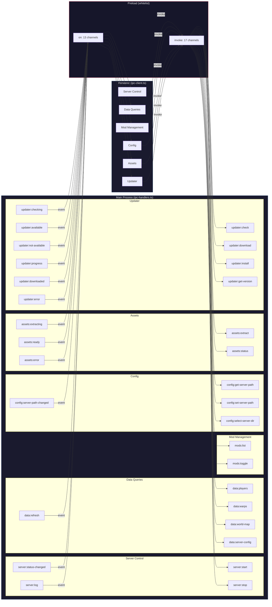

# IPC Channel Map

All inter-process communication in Hytale Server Manager flows through 30 named IPC channels defined in `app/src/shared/constants.ts`. Channels are split into two categories: **invoke channels** (17) for request/response calls from the renderer to the main process, and **event channels** (13) for push notifications from the main process to the renderer. Every channel must be whitelisted in the preload script (`app/src/preload/index.ts`) before it can be used.

Channels are organized into six domains: Server Control, Data Queries, Mod Management, Config, Assets, and Updater.

## Channel Flow Diagram

## Complete Channel Reference

### Server Control (4 channels)

| Channel | Direction | Type | Handler / Source | Renderer Consumer | Payload |
|---------|-----------|------|-----------------|-------------------|---------|
| `server:start` | Renderer -> Main | invoke | `server-process.start()` | `server-store.start()` | None |
| `server:stop` | Renderer -> Main | invoke | `server-process.stop()` | `server-store.stop()` | None |
| `server:status-changed` | Main -> Renderer | event | `server-process.setStatus()` | `server-store` listener | `status: 'stopped' \| 'starting' \| 'running' \| 'stopping'` |
| `server:log` | Main -> Renderer | event | `server-process.pushLog()` | `server-store` listener | `{ line: string, stream: 'stdout' \| 'stderr', timestamp: number }` |

### Data Queries (5 channels)

| Channel | Direction | Type | Handler / Source | Renderer Consumer | Payload |
|---------|-----------|------|-----------------|-------------------|---------|
| `data:players` | Renderer -> Main | invoke | `player-reader.readAllPlayers()` | `universe-store.fetchPlayers()` | Returns `{ data: PlayerData[], errors: string[] }` |
| `data:warps` | Renderer -> Main | invoke | `warp-reader.readWarps()` | `universe-store.fetchWarps()` | Returns `{ data: Warp[], error: string \| null }` |
| `data:world-map` | Renderer -> Main | invoke | `world-reader.readWorldMap()` | `universe-store.fetchWorldMap()` | Returns `{ data: WorldMapData, errors: string[] }` |
| `data:server-config` | Renderer -> Main | invoke | `fs.readFileSync(config.json)` | `ipc-client.getServerConfig()` | Returns `Record<string, unknown>` |
| `data:refresh` | Main -> Renderer | event | `file-watcher.pushRefresh()` | `universe-store`, `mod-store` listeners | `{ category: 'players' \| 'warps' \| 'worldMap' \| 'mods' }` |

### Mod Management (2 channels)

| Channel | Direction | Type | Handler / Source | Renderer Consumer | Payload |
|---------|-----------|------|-----------------|-------------------|---------|
| `mods:list` | Renderer -> Main | invoke | `mod-reader.readAllMods()` | `mod-store.fetchMods()` | Returns `{ data: ModInfo[], errors: string[] }` |
| `mods:toggle` | Renderer -> Main | invoke | `mod-manager.toggleMod()` | `mod-store.toggleMod()` | `{ modName: string, enabled: boolean }` |

### Config (4 channels)

| Channel | Direction | Type | Handler / Source | Renderer Consumer | Payload |
|---------|-----------|------|-----------------|-------------------|---------|
| `config:get-server-path` | Renderer -> Main | invoke | `server-path.getServerDir()` | `config-store.init()` | Returns `{ path: string, valid: boolean }` |
| `config:set-server-path` | Renderer -> Main | invoke | `server-path.setServerDir()` | `config-store.confirmPath()` | `newPath: string`. Returns `{ success: boolean, error?: string }` |
| `config:select-server-dir` | Renderer -> Main | invoke | `dialog.showOpenDialog()` | `config-store.selectDirectory()` | Returns `{ selected: boolean, path?: string, valid?: boolean }` |
| `config:server-path-changed` | Main -> Renderer | event | `ipc-handlers.ts` (after `set-server-path`) | `config-store` listener | `{ path: string, valid: boolean }` |

### Assets (5 channels)

| Channel | Direction | Type | Handler / Source | Renderer Consumer | Payload |
|---------|-----------|------|-----------------|-------------------|---------|
| `assets:extract` | Renderer -> Main | invoke | `asset-extractor.extractAssets()` | `asset-store.triggerExtraction()` | Returns `{ success: boolean, error?: string }` |
| `assets:status` | Renderer -> Main | invoke | `asset-extractor.areAssetsCached()` | `asset-store.init()` | Returns `{ cached: boolean }` |
| `assets:extracting` | Main -> Renderer | event | `index.ts`, `ipc-handlers.ts` | `asset-store` listener | None |
| `assets:ready` | Main -> Renderer | event | `index.ts`, `ipc-handlers.ts` | `asset-store` listener | None |
| `assets:error` | Main -> Renderer | event | `index.ts`, `ipc-handlers.ts` | `asset-store` listener | `{ message: string }` |

### Updater (10 channels)

| Channel | Direction | Type | Handler / Source | Renderer Consumer | Payload |
|---------|-----------|------|-----------------|-------------------|---------|
| `updater:check` | Renderer -> Main | invoke | `updater-service.checkForUpdates()` | `updater-store` | None |
| `updater:download` | Renderer -> Main | invoke | `updater-service.downloadUpdate()` | `updater-store` | None |
| `updater:install` | Renderer -> Main | invoke | `updater-service.quitAndInstall()` | `updater-store` | None |
| `updater:get-version` | Renderer -> Main | invoke | `updater-service.getVersion()` | `updater-store.init()` | Returns `string` |
| `updater:checking` | Main -> Renderer | event | `updater-service.ts` | `updater-store` listener | None |
| `updater:available` | Main -> Renderer | event | `updater-service.ts` | `updater-store` listener | `{ version: string, releaseDate: string, releaseNotes?: string }` |
| `updater:not-available` | Main -> Renderer | event | `updater-service.ts` | `updater-store` listener | None |
| `updater:progress` | Main -> Renderer | event | `updater-service.ts` | `updater-store` listener | `{ percent: number, bytesPerSecond: number, transferred: number, total: number }` |
| `updater:downloaded` | Main -> Renderer | event | `updater-service.ts` | `updater-store` listener | `{ version: string, releaseDate: string, releaseNotes?: string }` |
| `updater:error` | Main -> Renderer | event | `updater-service.ts` | `updater-store` listener | `{ message: string }` |

## Channel Summary

| Domain | Invoke Channels | Event Channels | Total |
|--------|----------------|---------------|-------|
| Server Control | 2 | 2 | 4 |
| Data Queries | 4 | 1 | 5 |
| Mod Management | 2 | 0 | 2 |
| Config | 3 | 1 | 4 |
| Assets | 2 | 3 | 5 |
| Updater | 4 | 6 | 10 |
| **Total** | **17** | **13** | **30** |

## Adding a New Channel

To add a new IPC channel, update these four files:

1. **`app/src/shared/constants.ts`** -- Add the channel name to the `IPC` const object
2. **`app/src/preload/index.ts`** -- Add to `ALLOWED_INVOKE_CHANNELS` or `ALLOWED_ON_CHANNELS`
3. **`app/src/main/ipc-handlers.ts`** (invoke) or the broadcasting module (event) -- Register the handler or send the event
4. **`app/src/renderer/services/ipc-client.ts`** -- Add a typed wrapper function
